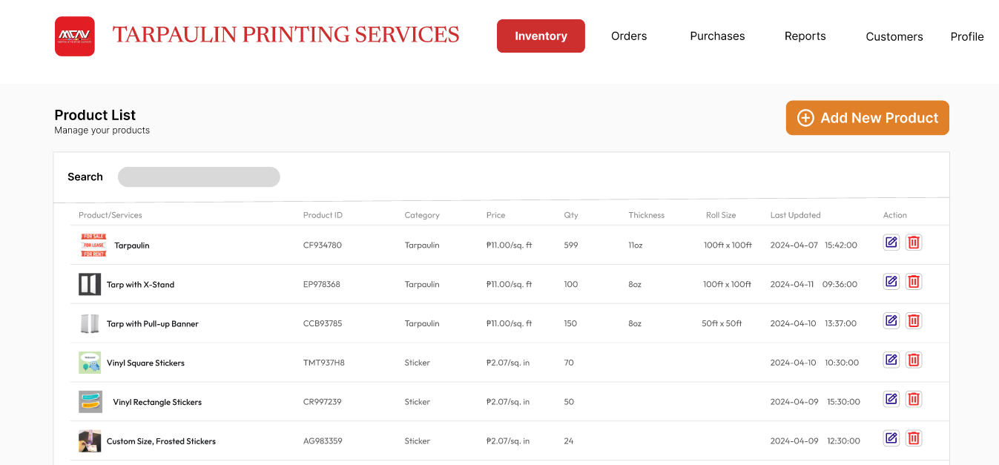
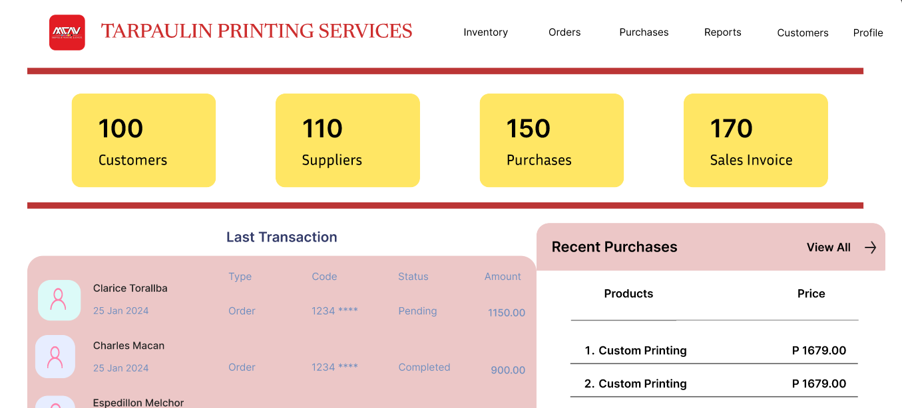
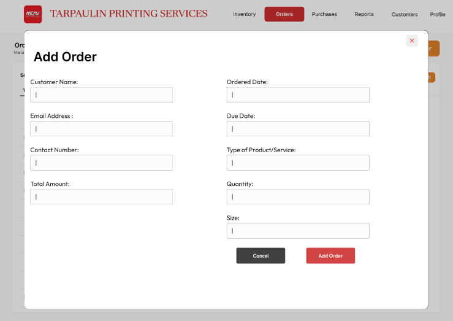
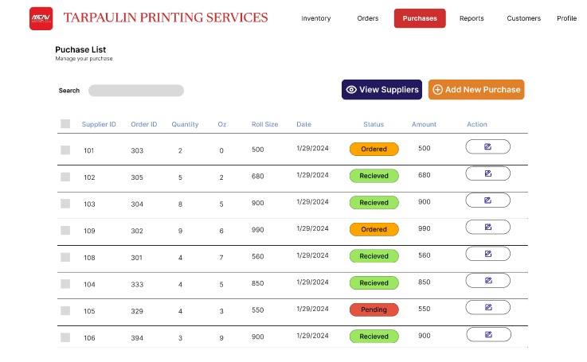
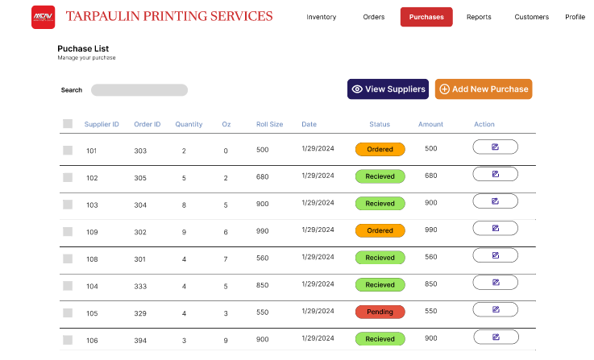

# MCAV-desktop-app  
A repository for MCAV desktop app. Storage space where all the code, assets, and documentation for the application are kept.

**Screenshot of the system**  
  

  

 
 
 
 
 
 
 
 

